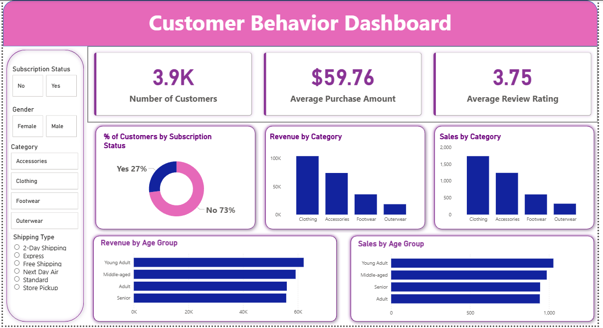

# 🛍️ Customer Behavior Analysis Dashboard

## 📌 Project Overview
This project presents an end-to-end data analytics workflow to analyze customer shopping behavior and derive actionable business insights. The analysis focuses on understanding customer segments, spending patterns, product performance, and subscription behavior.

---

## 🎯 Problem Statement
Businesses often struggle to identify:
- Which customers generate the most revenue
- Which products drive maximum sales
- How subscription and discounts affect purchasing behavior

This project aims to solve these problems using data-driven analysis.

---

## 📊 Dataset Summary
- 📌 Total Records: 3,900  
- 📌 Total Features: 18  
- 📌 Key Data Includes:
  - Customer demographics (Age, Gender, Subscription Status)
  - Product details (Category, Item Purchased)
  - Purchase behavior (Purchase Amount, Discounts, Frequency, Ratings)

---

## 🧹 Data Cleaning & Processing (Python)
- Data loaded using **Pandas**
- Handled missing values in **Review Rating**
- Standardized column names
- Created new features:
  - Age Groups
  - Purchase behavior metrics
- Removed redundant columns

---

## 🗄️ SQL Analysis (PostgreSQL)
Performed business-driven queries to extract insights:

- Revenue analysis by gender
- High-spending customers using discounts
- Top-rated products
- Shipping type comparison
- Subscriber vs non-subscriber behavior
- Customer segmentation (New, Returning, Loyal)
- Revenue contribution by age group

---

## 📈 Power BI Dashboard

### 🔥 Dashboard Preview


---

## 📊 Key Metrics
- 👥 **Total Customers:** 3.9K  
- 💰 **Average Purchase Amount:** $59.76  
- ⭐ **Average Rating:** 3.75  

---

## 💡 Key Insights
- Majority customers are **non-subscribers (~73%)**
- **Clothing category** generates highest revenue and sales
- **Young adults** contribute the most to revenue
- Loyal customers form a major portion of the customer base
- Discounts significantly influence purchasing behavior

---

## 🚀 Business Recommendations
- Introduce attractive offers to increase subscriptions  
- Implement loyalty programs for repeat customers  
- Optimize discount strategies to maintain profitability  
- Focus marketing efforts on high-revenue age groups  
- Promote top-performing product categories  

---

## 🛠️ Tools & Technologies
- Python (Pandas)
- PostgreSQL (SQL)
- Power BI (Data Visualization)

---

## 📁 Project Structure

```
customer_behaviour_analysis/
│
├── README.md
├── customer_shopping_behavior.csv
├── customer_behavior_dashboard.pbix
├── customer_behavior_sql_queries.sql
├── Customer_Shopping_Behaviour_Analysis.ipynb
├── Business Problem Document.pdf
├── presentation.pptx
│
└── screenshots/
    ├── dashboard.png
    ├── kpi.png
    ├── insights.png
    └── filters.png
```

---

## 🎯 Project Outcome
This project demonstrates:
✔ End-to-end data analysis pipeline  
✔ Data cleaning and transformation  
✔ SQL-based business analysis  
✔ Interactive dashboard creation  
✔ Business insight generation  

---

## 🙋‍♀️ Author
**Tanuja Ranjan**
